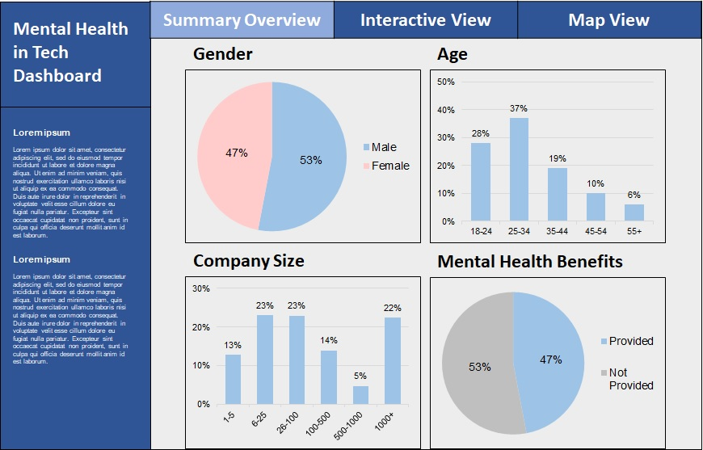
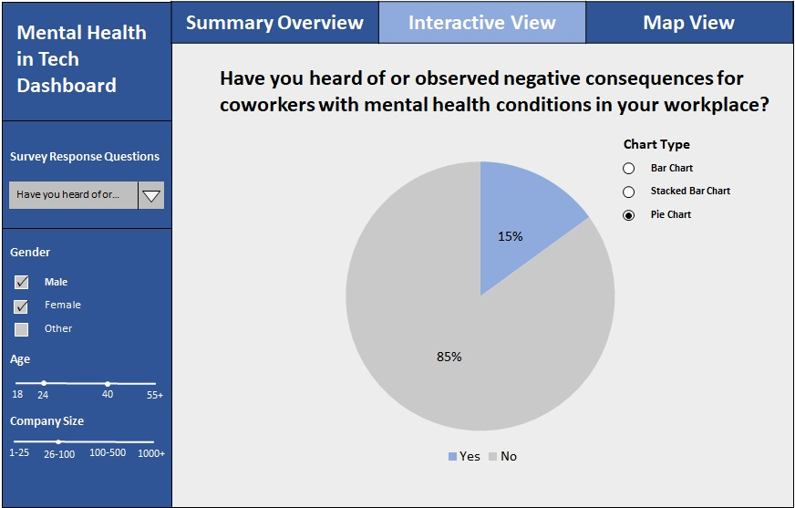
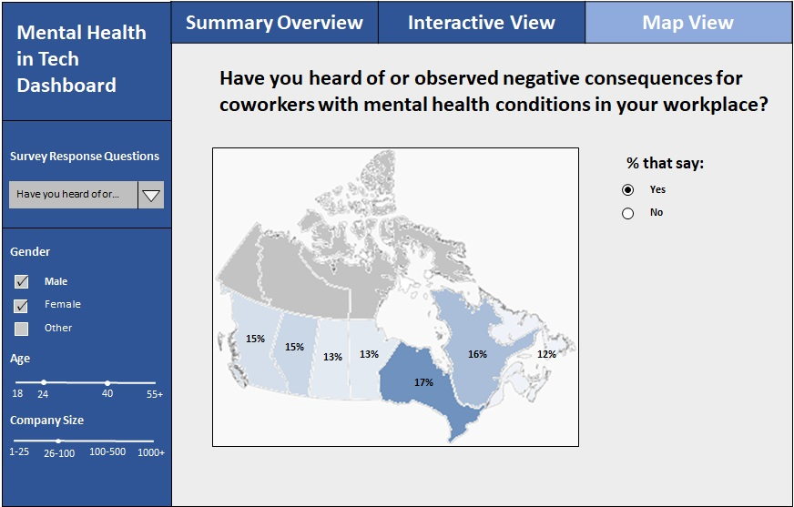

# Mental Health in Tech Dashboard

The Mental Health in Tech Dashboard is created using [Dash](https://plotly.com/dash/) and [Python](https://www.python.org/). The app aims to provides interactive visuals for users to explore the [2014 Mental Health in Tech Survey](https://osmihelp.org/research) results and interaction of the different variables (up to 27 variables) to see how mental health affect the worker in the tech worksplace as well as how well companies are prepared to help workers regarding mental health issues.

Link to Application
------------
[Web App](https://dsci-532-mental-health-python.herokuapp.com/)

#

Relevance
---------
It is important for both employer and employee to acknowledge the importance of mental health and how it can impact ones work performance at work especially in the tech industry. This dashboard is intended for both employer and employee (current or new) who are working in the tech industry to be able to visually explore the interaction of variables from the [2014 Mental Health in Tech Survey](https://osmihelp.org/research). The variables consisted of location of the respondents, demographic variables such as age and gender, employment status, company size, avaibility of benefit related to mental health or wellness program, impact on physical and work performance due to mental health etc..

Overview
--------
The app will consists of three main pages - Survey Overview, Variable view and a Map view.

### Survey Overview

It will contains description of the app and the survey. Some graphs will be used to show summary statistics regarding the survey independent responses in the form of bar charts or pie charts. There will be two major panels where the left panel provides the control for variable selection using dropdown menu. From a dropdown list user can filter out survey response questions (related to mental health) and a range of independent variable (demographic, company related) which a distribution of the responses will be show as bar charts or pie/donut charts on the right panel. 

### Variable View

This is the page which provides the visualization on the right panel to show the interaction between survey independent variables against survey response variables that related to worker's mental health. Most of the charts will be shown as bar charts which the response distribution of the survey response variable can be compare across different groups within the independent variables which can both be selected from the dropdown menu / radio buttons in left panel.

### Map View

A simple map which showcase how the survey response variables differs across each country/states (for US) where the distribution of the responses will be shown using different color scales for each location and simple response and variable selection will be shown on the left panel.

Example sketch of the Mental Health in Tech Dashboard:







Requirments
-----------

If you would like to run this dashboard locally you can follow this following instructions.

1. Clone this repo to your local machine via:

```sh
$ git clone https://github.com/UBC-MDS/mental_health_in_tech_dashboard.git
```

2. Navigate to the local files then run this following to setup a conda virtual environment in your choice of terminal:

```sh
$ conda env create -f environment.yaml
```

3. Activate the virtual environment in conda

```sh
$ conda activate mentalhealthdashboard
```

4. Then run this to initiate the dashboard:
```sh
$ Python "src/app.py"
```

5. Once the script is finished running, you can view the browser at:
```sh
$ http://127.0.0.1:8050/
```

Dataset and Acknowledgements
----------------------------
This dataset used in this tool is from a 2014 survey conducted by [Open Sourcing Mental Illness Ltd](https://osmihelp.org/about/about-osmi) that measures worker's attitudes towards mental health and frequency of mental health disorders in the tech workplace.

The dataset can be downloaded [here](https://www.kaggle.com/osmi/mental-health-in-tech-survey) or more recent survey raw data can be found [here](https://osmihelp.org/research).
The use of the data is licensed under a [Creative Commons Attribution-ShareAlike 3.0 International](https://creativecommons.org/licenses/by-sa/3.0/deed.en_US).

Authors
-------

- [Jordan Casoli](https://github.com/jcasoli)
- [Nick LiSheng Mao](https://github.com/nickmao1994)
- [Hatef Rahmani](https://github.com/hatefr)
- [Ho Kwan Lio](https://github.com/stevenlio88)


License
-------
Mental Health in Tech Dashboard was created by Jordan Casoli, Nick LiSheng Mao, Hatef Rahmani and Ho Kwan Lio. The materials are licensed under the terms of the MIT license (Copyright (c) 2022 Master of Data Science at the University of British Columbia). See [here](https://github.com/UBC-MDS/mental_health_in_tech_dashboard/blob/main/LICENSE) for details.

