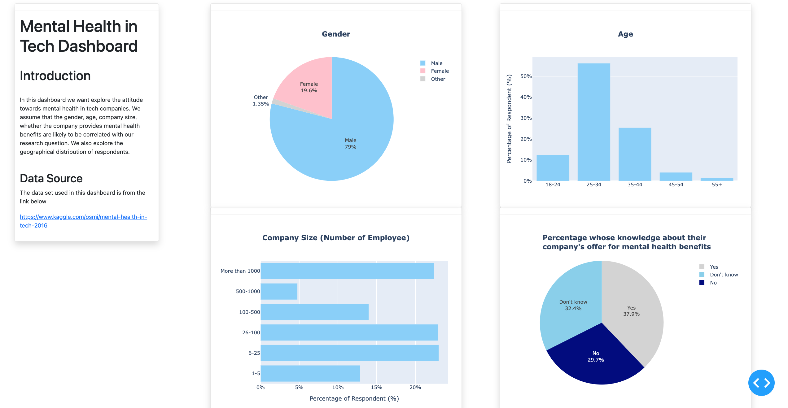
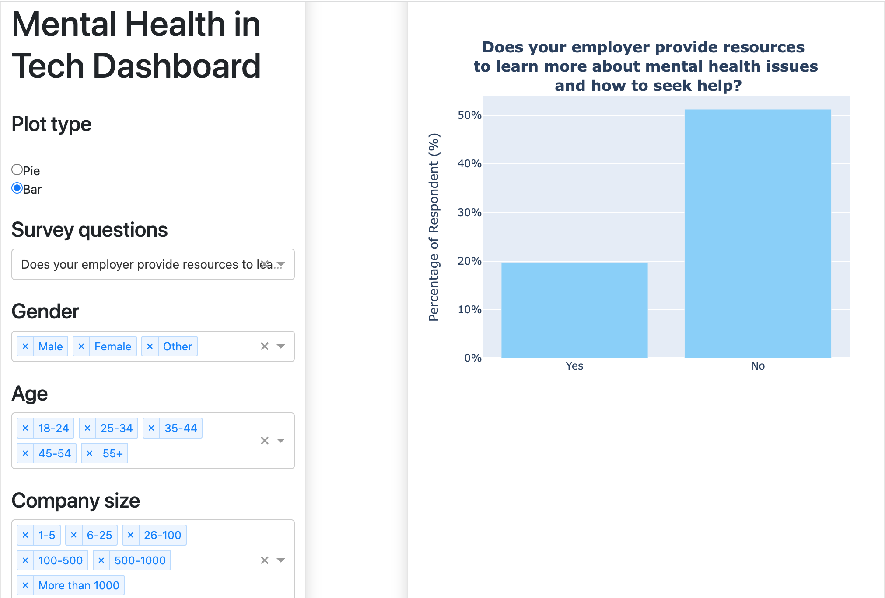
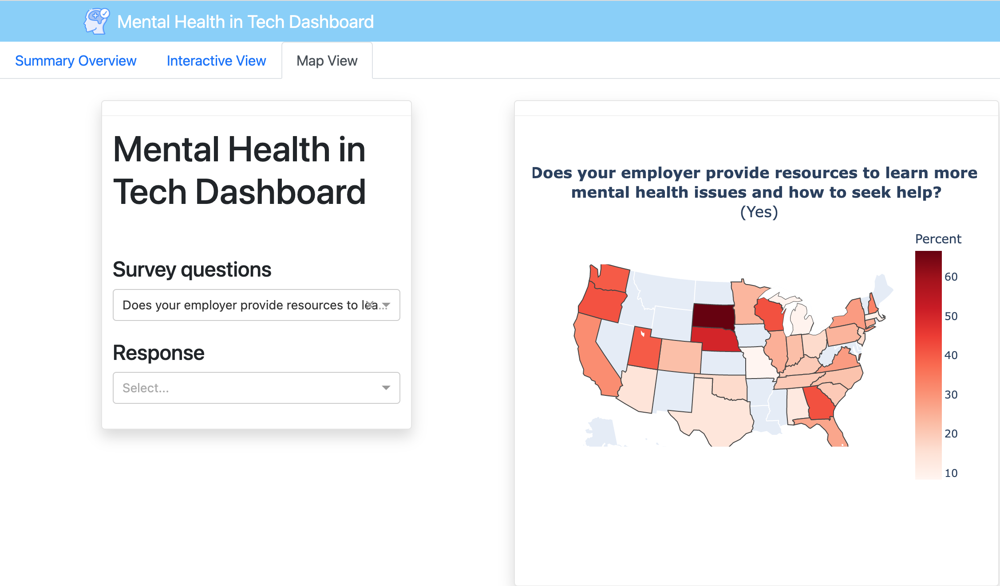

# Mental Health in Tech Dashboard

The Mental Health in Tech Dashboard is created using [Dash](https://plotly.com/dash/) and [Python](https://www.python.org/). The provides interactive visuals for users to explore the [2014 Mental Health in Tech Survey](https://osmihelp.org/research) results and interaction of the different variables to see how mental health affect the worker in the tech worksplace as well as how well companies are prepared to help workers regarding mental health issues.

Web App Link
------------
Here is the link to our Horaku deployment:

[Web App](https://dsci-532-mental-health-python.herokuapp.com/)

Motivation
---------
It is important for both employer and employee to acknowledge the importance of mental health and how it impacts work performance at work especially in the tech industry. This dashboard is intended for both employer and employee (current or new) who are working in the tech industry to be able to visually explore the interaction of variables from the [2014 Mental Health in Tech Survey](https://osmihelp.org/research). The variables consisted of location of the respondents, demographic variables such as age and gender, employment status, company size, avaibility of benefit related to mental health or wellness program, impact on physical and work performance due to mental health etc..

Overview of the dashboard
--------
The app will consists of three main pages - Summary Overview, Interactive View and a Map View.

### Summary Overview

In Summary View, four plots are presented along with some information on the dataset and data source (left panels). The graphs mainly show the summary statistics in the form of a bar or pie chart and include information about the gender and age of the employees as well company size and whether the employee has knowledge about the mental health benefits offered by the employer. Suitable plots are presented and the user can comrehensively look at the variations in age, gender, company size and relates those to the mental health issue in tech industry. 

### Interactive View

In ths view, an interactive plot is presented to show the percentage of copanies that offer mental health befit. Thsi is an interactive graph, and the user can select the survery question, age, gender, and company size from the dropdown menu / radio buttons in left panel, and examine how the plot changes. The user has also the option to see the data in either pie or bar plot. 

### Map View

The Map View is perhaps the most interesting and informative plot among all. A simple interactive map is presented showcasing how the survey response variables differs across each different states in US. The user can select the appropriate response and variables from the left panel and by hovering the mouse on the map, the quantitave statistics are shown. The distribution of responses is also shown on the map using color scheme. 


Example sketches of the Mental Health in Tech Dashboard are provided below:








Developer Contribution
-----------
The egenral procedures to contribute to the current dashboard is outlined in the contributing file. If ineterested, there are some potentials that other developers can work on. For example, the original datset has as many as 27 features, but in this dashboard we have only included 7-8 of the fetures. There are also some romms for further improvements in our Map View. The current view works fine but the authors feel like it can be modified to include many more information. 

App Installation
-----------

If you would like to run this dashboard locally you can follow this following instructions.

1. Clone this repo to your local machine via:

```sh
$ git clone https://github.com/UBC-MDS/mental_health_in_tech_dashboard.git
```

2. Navigate to the local files then run this following to setup a conda virtual environment in your choice of terminal:

```sh
$ conda env create -f environment.yaml
```

3. Activate the virtual environment in conda

```sh
$ conda activate mentalhealthdashboard
```

4. Then run this to initiate the dashboard:
```sh
$ Python "src/app.py"
```

5. Once the script is finished running, you can view the browser at:
```sh
$ http://127.0.0.1:8050/
```

Dataset and Acknowledgements
----------------------------
This dataset used in this tool is from a 2014 survey conducted by [Open Sourcing Mental Illness Ltd](https://osmihelp.org/about/about-osmi) that measures worker's attitudes towards mental health and frequency of mental health disorders in the tech workplace.

The dataset can be downloaded [here](https://www.kaggle.com/osmi/mental-health-in-tech-survey) or more recent survey raw data can be found [here](https://osmihelp.org/research).
The use of the data is licensed under a [Creative Commons Attribution-ShareAlike 3.0 International](https://creativecommons.org/licenses/by-sa/3.0/deed.en_US).

Authors
-------

- [Jordan Casoli](https://github.com/jcasoli)
- [Nick LiSheng Mao](https://github.com/nickmao1994)
- [Hatef Rahmani](https://github.com/hatefr)
- [Ho Kwan Lio](https://github.com/stevenlio88)


License
-------
Mental Health in Tech Dashboard was created by Jordan Casoli, Nick LiSheng Mao, Hatef Rahmani and Ho Kwan Lio. The materials are licensed under the terms of the MIT license (Copyright (c) 2022 Master of Data Science at the University of British Columbia). See [here](https://github.com/UBC-MDS/mental_health_in_tech_dashboard/blob/main/LICENSE) for details.

